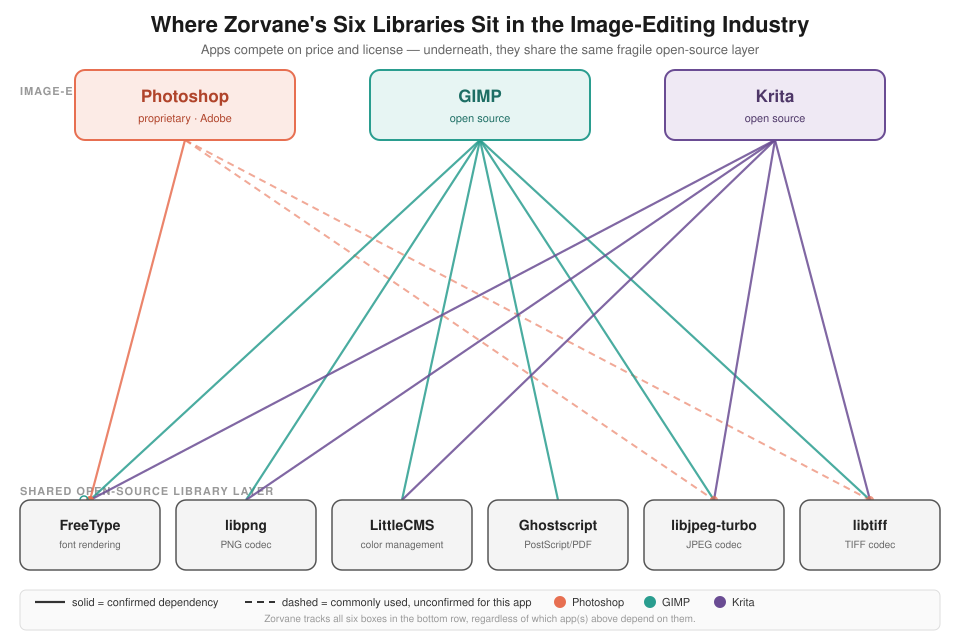
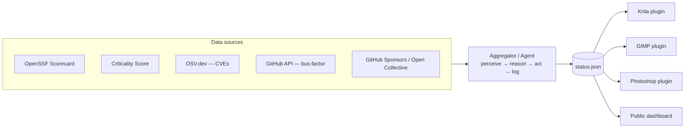
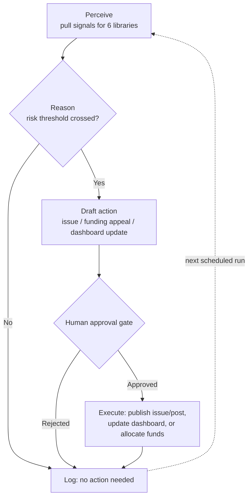
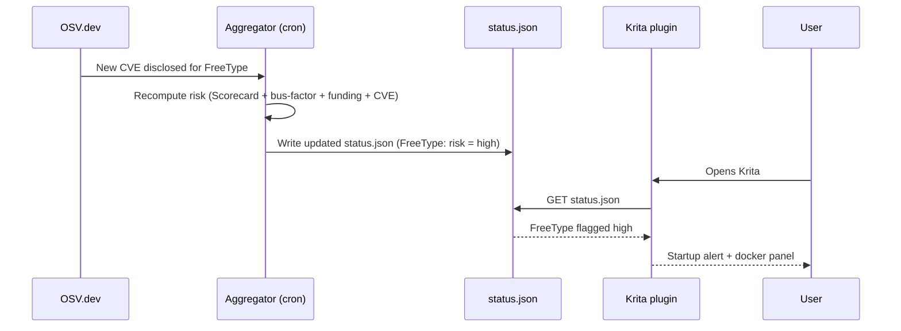

# Zorvane

An agent that watches the open-source libraries powering every image editor — proprietary and free alike — for security risk, maintainer fragility, and funding gaps, then acts on what it finds.

## Origin

Adobe holds an estimated 70% share of the digital art software market and ~41M paid Creative Cloud subscribers, funded by $23.8B/year in revenue. Open-source alternatives (GIMP, Krita) exist and are improving, but adoption friction against an entrenched incumbent isn't primarily a technology problem — it's a "people choosing to quit" problem. The 2024 Adobe Terms-of-Service backlash (silent ToS changes granting broad content-access rights, an FTC suit over deceptive subscription practices) showed there's real appetite to leave, but no comparable infrastructure or incentive pulling people toward alternatives.

Zorvane doesn't attack that adoption-friction problem directly. Instead it targets a sharper, underlying fact: **GIMP, Krita, and Photoshop all depend on the same small set of open-source libraries** — and that shared layer is underfunded and fragile regardless of which editor wins.

## Problem space we validated

**Open source's structural problem:** 300 million companies use open-source software; roughly 4,200 pay anything toward it. 60% of maintainers work unpaid, 44% of those who leave cite burnout. Real infrastructure has already died from this — Kubernetes retired Ingress NGINX, and External Secrets Operator froze updates, both from maintainer burnout.

**Security is the other half:** 86% of commercial codebases carry open-source vulnerabilities, average codebase has 911 components with 90% four-plus years stale. The XZ Utils backdoor (CVSS 10.0) proved a two-year social-engineering campaign can compromise foundational infrastructure with almost no one noticing until it was nearly too late.

**The specific gap in the image-editing space:** Photoshop, GIMP, and Krita all bundle the same open-source libraries under the hood:

| Library | Role | Confirmed used by |
|---|---|---|
| FreeType | Font rendering | GIMP, Krita, **and Photoshop** (per Adobe's own third-party notices) |
| libpng | PNG encode/decode | GIMP, Krita |
| LittleCMS (lcms2) | Color management / ICC profiles | GIMP, Krita |
| Ghostscript | PostScript/PDF interpretation | GIMP |
| libjpeg-turbo | JPEG encode/decode | Near-universal across image editors |
| libtiff | TIFF file support | GIMP, Krita, most raster editors |

This isn't hypothetical risk — FreeType had an actively-exploited zero-day (CVE-2025-27363), and ImageMagick's "ImageTragick" (CVE-2016-3714) was a full remote-code-execution bug triggered by a crafted image file. A vulnerability or an abandonment in any of these six libraries has blast radius across proprietary and open-source tools alike.

## Existing solutions we checked before building anything

| Tool | What it does | Why it's not enough on its own |
|---|---|---|
| [Tidelift](https://tidelift.com) | Enterprise subscriptions funneled to maintainers based on customers' dependency trees | B2B/compliance-driven; no security-risk weighting; doesn't apply to desktop apps without a package manifest |
| [thanks.dev](https://thanks.dev) | Scans your dependency tree, distributes a budget to your dependencies | Same manifest-based limitation; no risk scoring |
| BackYourStack (Open Collective) | Matches your dependencies to Open Collective funding pages | Funding lookup only, no health/security signal |
| [OpenSSF Scorecard](https://scorecard.dev) | Scores a repo 0–10 on security practice hygiene | Measures hygiene only, no funding or bus-factor signal |
| [OpenSSF Criticality Score](https://github.com/ossf/criticality_score) | Scores how foundational/depended-upon a project is | No health or funding signal |
| OpenSauced "Lottery Factor" | Flags bus-factor risk from commit concentration | No funding or CVE signal |
| Academic abandonment-prediction research (arXiv 2507.21678) | Survival-analysis model, 0.846 predictive accuracy on 115K+ repos | Research artifact, not a usable product |

**The gap:** every one of these solves one slice (funding, or security hygiene, or bus-factor, or CVEs) in isolation. Nobody combines all four signals for a specific, shared, cross-cutting layer like image-processing libraries — and nobody acts on the combined signal, they just report it.

## What we're building

Not a new payment system, not a new scoring methodology — a synthesis layer plus an agent that acts on it, routing to funding rails that already exist (GitHub Sponsors, Open Collective) rather than reinventing them.

**Per-library tracked signals:**
- OpenSSF Scorecard score
- Criticality Score
- Bus-factor (% of commits held by top 1–2 contributors, computed from GitHub history)
- Open/recent CVEs
- Current funding status and amount

**Composite risk flag:** high criticality + low bus-factor + open CVE + no/low funding = flagged.

## Architecture

Every plugin and the dashboard are thin clients of one file. The aggregator is the only component that talks to the five data sources — phase 2 upgrades what happens inside that box without touching anything downstream of `status.json`.

## Agentic architecture

Zorvane is not a scheduled report generator — it's an agent loop: **perceive → reason → act → log**.

- **Perceive** — pull the five signals above for each tracked library on a schedule.
- **Reason** — an LLM is handed the current and prior state and decides: did anything materially change, does any library cross a risk threshold, and what's the right response (nothing, an internal note, or a visible action)?
- **Act** — the agent has real tools, not just report output:
  - `draft_github_issue` — flags the specific concern on the at-risk library's own repo
  - `draft_funding_appeal` — generates a sponsor-outreach post pointing at the library's existing funding page
  - `post_to_dashboard` — updates the public status page
  - `allocate_funds` — (future) triggers a payout or token-based allocation once a Payments layer exists
- **Log** — every decision and action is persisted, so the agent has continuity and doesn't re-flag the same finding every run.

**Guardrails (v1):** the agent drafts everything but a human approves before anything goes out publicly (an issue, a sponsor post) or moves money. Auto-execution of low-stakes actions (dashboard updates) can be enabled once the drafting quality is trusted; anything irreversible stays gated.

## End-to-end example

## Tech stack

| Layer | Tool |
|---|---|
| Agent reasoning / tool-use | Anthropic Claude API (tool-calling) or the Claude Agent SDK |
| Security health data | OpenSSF Scorecard API |
| Criticality data | OpenSSF Criticality Score |
| Vulnerability data | OSV.dev API |
| Contributor / bus-factor data | GitHub REST/GraphQL API |
| Funding data | GitHub Sponsors API, Open Collective API |
| Action: issue creation | GitHub API |
| Action: outreach drafts | Webhook (Discord/Slack/email) |
| Scheduling | GitHub Actions scheduled workflow (cron) — no server required |
| State / memory | JSON or SQLite log of past decisions, re-loaded into agent context each run |
| Frontend | Static site (plain HTML/CSS/JS) reading the state file, deployed on GitHub Pages |

Deliberately boring: no server to run, no database to manage, no payment integration to build in v1 — just API calls, a scheduled agent loop, and a static page.

## Where this sits against broader categories

- **Agentic Systems & Workflows** — yes, core to the design (the perceive/reason/act/log loop above).
- **Payments** — not in v1 (routes to existing funding rails); the natural extension is a token-based allocation mechanism (`allocate_funds`) weighted by the composite risk score, revisiting the original token-burn idea behind this project's parent folder name.
- **Zero-Human Companies** — out of scope; would require the agent to also own funding decisions and payouts end-to-end with no human checkpoint, which conflicts with the v1 guardrails above.
- **Physical AI** — not applicable, no genuine connection to this problem space.

## Status

Concept and architecture defined. No code written yet. Next step: scaffold the repo structure and the perceive-stage data pulls (Scorecard, OSV, GitHub API) before wiring in the reasoning/action loop.
